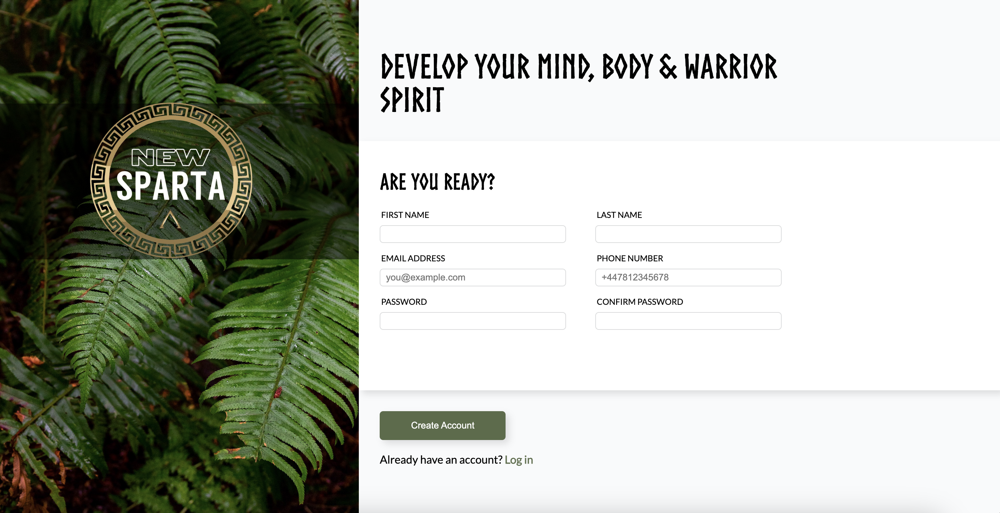

# sign-up-form-top
A Sign-Up Form created for The Odin Project curriculum. 

Live - https://dylewskii.github.io/sign-up-form-top/

## Languages used:

-    
-    
- 

## Sign Up Form Goal:

## Final Outcome:

## Future TODO:
1. Set up more advanced form validation.
2. Offer the ability to log in.
3. Add mobile responsiveness.